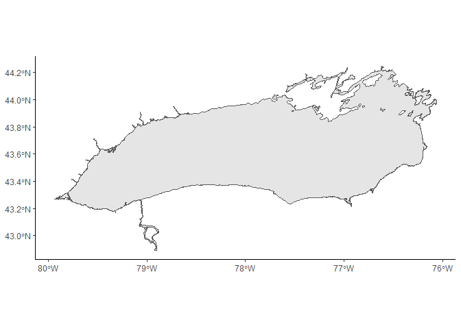

<!-- README.md is generated from README.Rmd. -->

# lakeontario

<!-- badges: start -->
<!-- badges: end -->

The goal of `lakeontario` is to provide a suite of R tools and templates
to support fisheries data collection and analysis on Lake Ontario.

## Installation

You can install `lakeontario` from [GitHub](https://github.com/) with:

``` r
# install.packages("devtools")
devtools::install_github("HoldenJe/lakeontario")
```

## Example

A basemap of the Lake Ontario shoreline shapefile is stored as a base
ggplot object.

``` r
library(lakeontario)
base_ontarioshore
```



File templates for Rmarkdown documents.

``` r
usethis::use_template(
    template = "multiagent.Rmd",
    save_as = file.path("Reports/2_FEED_pointblank_error_check_report.Rmd"),
    package = "lakeontario"
  )
```
